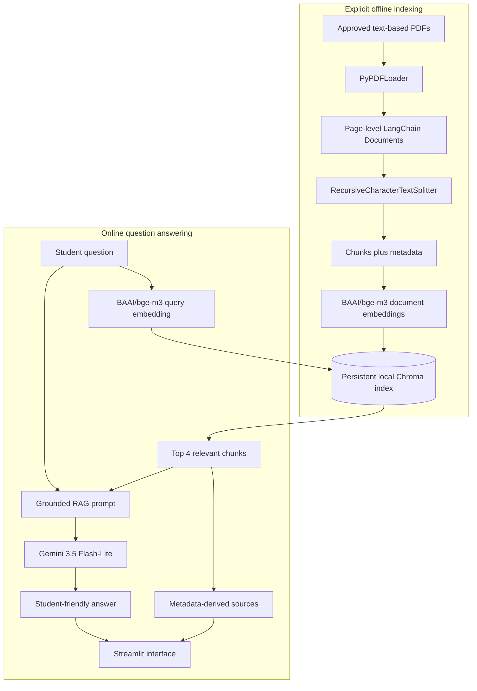

# Student Support Copilot

**A RAG-Based University Assistance Chatbot**

Student Support Copilot is a local-first university information assistant built
with Streamlit, LangChain, BGE-M3, Chroma, and Google Gemini. It retrieves
relevant passages from approved university documents, asks Gemini to answer
using that evidence, and displays the source filename, page, and category used.

The repository currently uses clearly labelled, fictional **Northbridge
University** documents for development and demonstration. It is a student
project, not an official university service, and it cannot make academic
decisions or access private student records.

## Project overview

University guidance is often spread across policy PDFs, handbooks, module
documents, and service guides. Students may have to search several long files
to answer a straightforward question, while staff repeatedly receive similar
requests.

This project explores Retrieval-Augmented Generation (RAG) as a safer way to
make that information easier to find. Instead of asking a language model to
answer from general knowledge, the application first searches a controlled
document collection and then supplies only the most relevant passages to the
answer-generating model.

The knowledge base covers four areas:

| Category | Example topics |
| --- | --- |
| Examinations | Registration, missed examinations, deferrals, resits, conduct, and appeals |
| Modules | Credits, prerequisites, registration, assessment, failure, and progression |
| Student Services | Library, IT support, careers, counselling, accessibility, and student letters |
| Academic Regulations | Attendance, late work, extensions, integrity, appeals, suspension, and withdrawal |

## Key features

- Clean Streamlit chat interface with session-based message history and a clear-chat action.
- Page-by-page extraction from machine-readable PDFs using LangChain's `PyPDFLoader`.
- Retrieval-friendly text chunks with preserved source metadata and deterministic chunk IDs.
- Local, normalized, 1,024-dimensional dense embeddings from `BAAI/bge-m3`.
- Persistent local Chroma vector storage using cosine distance.
- Dense semantic retrieval across all four categories with an initial `TOP_K` of 4.
- A transparent two-step RAG flow: retrieve evidence first, then generate an answer.
- Grounded Gemini prompt rules that prohibit invented university policies and official decisions.
- Source citations derived from stored metadata rather than generated by the LLM.
- Centralized index configuration, SHA-256 document-change detection, an index manifest,
  staging validation, and one-generation rollback.
- Automated tests for document loading, chunking, embeddings, vector storage, index
  management, retrieval, prompting, Gemini error handling, citations, and RAG orchestration.

## RAG architecture

The project deliberately keeps document preparation separate from live question
answering. The Streamlit application opens an existing index; it does not rebuild
the knowledge base on every rerun.



### How the RAG workflow works

1. **Load:** Each text-based PDF is read one page at a time into a LangChain
   `Document`. A `Document` keeps extracted text together with metadata such as
   filename, page, and category.
2. **Chunk:** `RecursiveCharacterTextSplitter` divides long page text into
   smaller sections. The current experimental settings are 800 characters with
   120 characters of overlap.
3. **Embed:** BGE-M3 converts every chunk into a normalized numerical vector.
   Text with similar meaning should be placed closer together in this vector
   space.
4. **Store:** Chroma persists the vectors, original chunk text, deterministic
   IDs, and metadata under `data/chroma_db/`.
5. **Retrieve:** The same BGE-M3 model embeds the student's question. Chroma
   compares it with stored vectors using cosine distance and returns up to four
   nearby chunks.
6. **Generate:** Gemini receives the current question, retrieved chunk text,
   limited source metadata, and grounding instructions. It generates the answer;
   it is not used for embeddings or retrieval.
7. **Cite:** The application formats sources directly from retrieved metadata,
   so the source list is independent of the LLM's wording.

## Technology stack

| Component | Technology | Purpose |
| --- | --- | --- |
| Language | Python 3.10+ | Application, document processing, indexing, retrieval, and tests |
| User interface | Streamlit 1.48.0 | Browser-based chatbot and session state |
| RAG framework | LangChain | Standard document, embedding, retrieval, prompt, and model interfaces |
| PDF extraction | PyPDF / `PyPDFLoader` | Local page-level text extraction from PDFs |
| Text splitting | `RecursiveCharacterTextSplitter` | Creates focused, overlapping retrieval chunks |
| Embeddings | `BAAI/bge-m3` through `langchain-huggingface` | Local semantic vectors for documents and questions |
| Vector store | Chroma through `langchain-chroma` | Persistent local vectors, text, IDs, and metadata |
| Retrieval | Dense similarity search, cosine distance, `TOP_K = 4` | Finds evidence related to the current question |
| Answer generation | Gemini 3.5 Flash-Lite through `langchain-google-genai` | Produces a concise answer from retrieved evidence |
| Configuration | `.env` and `python-dotenv` | Keeps the Gemini key outside source code |
| Tests | Python `unittest` | Fast automated validation with local fakes and mocks |

Only versions intentionally pinned by this repository are pinned in
`requirements.txt`; install from that file to obtain the project's compatible
dependency set.

## Project structure

```text
student-support-copilot/
|-- app.py                         # Streamlit interface and session state
|-- requirements.txt              # Python dependencies
|-- .env.example                  # Safe environment-variable template
|-- .gitignore                    # Excludes secrets, environments, caches, and generated data
|-- README.md                     # Public project guide
|-- PROJECT_SCOPE.md              # Goals, boundaries, users, and success criteria
|-- AGENTS.md                     # Incremental development and architecture rules
|-- scripts/
|   |-- __init__.py
|   `-- rebuild_index.py          # Index status, rebuild, and rollback CLI
|-- documents/
|   |-- raw/
|   |   |-- examinations/
|   |   |   `-- mock_examinations_policy.pdf
|   |   |-- modules/
|   |   |   `-- mock_modules_handbook.pdf
|   |   |-- student_services/
|   |   |   `-- mock_student_services_guide.pdf
|   |   `-- academic_regulations/
|   |       `-- mock_academic_regulations.pdf
|   `-- processed/                # Reserved for derived document artifacts
|-- data/
|   `-- chroma_db/                # Generated local index; ignored by Git
|-- evaluation/
|   |-- retrieval_questions.json  # Small retrieval evaluation set
|   `-- generation_questions.json # Grounded-answer evaluation worksheet
|-- src/
|   |-- __init__.py
|   |-- config.py                 # Central index-defining and retrieval settings
|   |-- document_loader.py        # PDF validation, extraction, and metadata normalization
|   |-- text_splitter.py          # Chunking and deterministic chunk IDs
|   |-- embeddings.py             # Cached local BGE-M3 embedding model
|   |-- vector_store.py           # Persistent Chroma operations
|   |-- index_manifest.py         # Provenance records and content-change comparison
|   |-- index_manager.py          # Safe staging, promotion, and rollback
|   |-- retriever.py              # Dense retrieval and optional category filtering
|   |-- prompts.py                # Grounded prompt and retrieved-context formatting
|   |-- llm.py                    # Gemini configuration, invocation, and safe errors
|   |-- source_formatter.py       # Deterministic source citation formatting
|   `-- rag_pipeline.py           # Retrieval-then-generation orchestration
`-- tests/
    |-- __init__.py
    |-- test_config.py
    |-- test_document_loader.py
    |-- test_text_splitter.py
    |-- test_embeddings.py
    |-- test_vector_store.py
    |-- test_index_manifest.py
    |-- test_index_manager.py
    |-- test_retriever.py
    |-- test_prompts.py
    |-- test_llm.py
    |-- test_source_formatter.py
    `-- test_rag_pipeline.py
```

Files named `.gitkeep` preserve intentionally empty directories and are omitted
from the tree above for readability.

## Getting started

### Prerequisites

- Python 3.10 or newer
- Git, if cloning the repository
- A Gemini Developer API key for answer generation
- Enough local memory and disk space for BGE-M3 and the Chroma index

The first operation that loads BGE-M3 may download a large model from Hugging
Face and take several minutes. Later runs reuse the model from the local Hugging
Face cache, although each new Python process still loads it into memory.

### Windows setup

Clone or download the repository, open PowerShell in its root directory, and run
the following commands.

1. Create a virtual environment:

   ```powershell
   python -m venv .venv
   ```

2. Activate it:

   ```powershell
   .\.venv\Scripts\Activate.ps1
   ```

   If PowerShell blocks local activation scripts, allow them only for the
   current terminal and try again:

   ```powershell
   Set-ExecutionPolicy -Scope Process -ExecutionPolicy Bypass
   .\.venv\Scripts\Activate.ps1
   ```

3. Install the project dependencies:

   ```powershell
   python -m pip install -r requirements.txt
   ```

4. Create your private local configuration:

   ```powershell
   Copy-Item .env.example .env
   ```

5. Open `.env` in a text editor and add your key:

   ```text
   GOOGLE_API_KEY=your_gemini_api_key
   LLM_MODEL=gemini-3.5-flash-lite
   ```

6. Build the local knowledge index:

   ```powershell
   python scripts/rebuild_index.py status
   python scripts/rebuild_index.py rebuild
   ```

   Review the reported changes, then type `yes` when prompted.

7. Start the chatbot:

   ```powershell
   python -m streamlit run app.py
   ```

Streamlit normally opens `http://localhost:8501`. Press `Ctrl+C` in PowerShell
to stop the server.

### Optional macOS or Linux setup

```bash
python3 -m venv .venv
source .venv/bin/activate
python -m pip install -r requirements.txt
cp .env.example .env
python scripts/rebuild_index.py status
python scripts/rebuild_index.py rebuild
python -m streamlit run app.py
```

Add the Gemini key to `.env` before starting Streamlit. The project is primarily
documented and validated on Windows; platform-specific dependency behavior may
vary on other systems.

## Environment configuration

The application reads two environment variables:

| Variable | Required | Meaning |
| --- | --- | --- |
| `GOOGLE_API_KEY` | Yes, for generated answers | Authenticates requests to the Gemini Developer API |
| `LLM_MODEL` | No | Overrides the default `gemini-3.5-flash-lite` model name |

Never add a real key to `.env.example`, source code, screenshots, issues, or
commits. The local `.env` file is excluded by `.gitignore`. If the key is
missing, the interface shows a safe configuration message rather than exposing
an internal traceback.

## Knowledge documents

Place approved, machine-readable PDFs in the matching category folders:

```text
documents/raw/
|-- examinations/
|-- modules/
|-- student_services/
`-- academic_regulations/
```

The administrative rebuild requires at least one PDF in every configured
category. It discovers only `.pdf` files inside these four folders. It does not
index `README.md`, project instructions, tests, logs, environment files, or
source code.

The included PDFs describe a fictional institution named Northbridge University
and use non-routable example contact addresses. They are suitable for software
development and demonstrations but are not real policies. When replacing them:

1. Stop Streamlit.
2. Add, replace, move, or remove PDFs in the appropriate category folders.
3. Keep at least one approved PDF in each category.
4. Run `python scripts/rebuild_index.py status`.
5. Run `python scripts/rebuild_index.py rebuild` if changes are reported.
6. Restart Streamlit and test representative questions from all four categories.

Only use documents that are public, fictional, created for testing, or
explicitly approved. Do not add student names, registration numbers, results,
medical details, financial information, credentials, private correspondence, or
other confidential records. Original PDFs are never overwritten during indexing.

## Managing the knowledge index

Index updates are explicit administrative operations. Stop Streamlit before a
rebuild or rollback so another process does not hold the embedded Chroma
database.

### Check index status

```powershell
python scripts/rebuild_index.py status
```

This read-only command compares current source-document SHA-256 hashes and
index-defining settings with the active manifest. A timestamp-only file change
does not trigger a rebuild.

### Safely rebuild the index

```powershell
python scripts/rebuild_index.py rebuild
```

The command asks for confirmation, loads and chunks all approved PDFs, creates a
uniquely named staging collection, embeds and stores the chunks, validates IDs,
counts, and category coverage, and promotes the new collection only after those
checks pass. If staging fails, the active collection is preserved.

For a reviewed non-interactive workflow:

```powershell
python scripts/rebuild_index.py rebuild --yes
```

Use `--force` only when an intentional rebuild is needed even though the
documents and index-defining configuration are unchanged:

```powershell
python scripts/rebuild_index.py rebuild --force --yes
```

A complete rebuild is required after changing source document content, the
embedding model or dimension, normalization, chunk size or overlap, required
metadata or its schema version, the Chroma collection name, or the distance
metric. Changing retrieval-only `TOP_K` does not require re-embedding.

### Roll back one generation

```powershell
python scripts/rebuild_index.py rollback
```

After confirmation, the active and previous collections are swapped. The
replaced generation becomes the next rollback option. The project retains one
previous generation, not a complete backup history.

## Index manifest

Each successful rebuild writes the active manifest to:

```text
data/chroma_db/index_manifest.json
```

It records:

- a unique build ID and UTC build time;
- the index-defining configuration and its SHA-256 fingerprint;
- each source PDF's relative path, category, size, and SHA-256 content hash;
- total document, page, and chunk counts; and
- per-category chunk counts.

The manifest makes the relationship between source documents, configuration,
and stored vectors inspectable. The entire `data/chroma_db/` directory is
generated locally and ignored by Git, so a fresh clone must build its own index.

## Using the chatbot

1. Start Streamlit with `python -m streamlit run app.py`.
2. Review the four supported categories shown on the page.
3. Enter one clear, self-contained question in the chat box.
4. Wait while BGE-M3 retrieves local evidence and Gemini generates an answer.
5. Open **View supporting sources** to inspect the source filename, page, and
   category.
6. Select **Clear chat** to remove messages from the current browser session.

Example questions for the included fictional documents:

- I was sick and missed my exam. What should I do?
- What happens if I fail a module?
- I cannot access the student portal. Who should I contact?
- What happens if I submit an assignment late?
- How can I borrow books from the university library?

The first question after starting a new process can take longer because BGE-M3
must be loaded into memory. Later questions reuse the model object within that
process.

## Testing and validation

Run the complete automated test suite from the repository root:

```powershell
python -m unittest discover -s tests -v
```

The tests use small local embedding fakes and a mocked model client where
appropriate, so they validate project behavior without rebuilding the real
BGE-M3 index or making a Gemini request.

Optional syntax validation:

```powershell
python -m compileall app.py src scripts tests
```

The JSON files in `evaluation/` provide a small set of supported, paraphrased,
and unsupported questions for manual retrieval and grounded-generation review.
They are development materials, not evidence of production-level accuracy.

## Privacy and security

The following processing remains on the local machine:

- PDF extraction and chunking;
- BGE-M3 document and query embeddings;
- Chroma vector storage and semantic search; and
- index manifests, staging collections, and rollback data.

For each submitted question, the external Gemini Developer API receives the
current question, the selected retrieved chunk text, limited source metadata,
and grounding instructions. The complete PDFs, vector index, previous chat
turns, and generated embeddings are not included in the RAG prompt.

Do not enter confidential or personally identifiable student information. Do
not use private university documents without an approved legal, security, and
privacy process. A public deployment would also require authentication, access
control, logging policy, rate limiting, secret management, and a formal review
of the external data flow.

## Current limitations

- The included Northbridge University material is fictional and must not be
  presented as official guidance.
- Only text-based PDFs are supported. Scanned/image-only PDFs require OCR, which
  is not implemented.
- Damaged, empty, unsupported, and password-protected PDFs are rejected.
- Every question is processed independently. Earlier messages remain visible in
  the UI but are not used as retrieval or generation context.
- Vector search always returns nearest neighbours when possible. There is no
  calibrated retrieval-confidence threshold, so unsupported-question handling
  still depends on Gemini following the grounding prompt.
- Chunk size, overlap, and `TOP_K` are experimental settings based on a small
  fictional dataset.
- Retrieval uses dense similarity only. There is no hybrid search, sparse
  search, reranking, MMR, query rewriting, or automatic category classification.
- Knowledge updates use full rebuilds rather than incremental per-document
  indexing.
- Only one prior index generation is retained for rollback.
- Generation requires network access, a valid Gemini key, model availability,
  and provider quota. Token streaming is not implemented.
- The local embedded Chroma setup is intended for a single-user prototype, not
  concurrent administrative writers or a production service.
- Authentication, real student-system integration, agents, Docker, and
  deployment are not implemented.
- The chatbot provides informational assistance only and cannot approve appeals,
  extensions, mitigating circumstances, module registration, examination
  changes, or any other official decision.

## Future improvements

- Evaluate retrieval and generated-answer faithfulness on a larger, independently
  reviewed question set.
- Add a calibrated answerability check for unsupported questions.
- Add conversation-aware question rewriting while keeping official document
  evidence authoritative.
- Experiment with chunk settings, retrieval depth, and reranking only after
  establishing evaluation baselines.
- Add a controlled administrative interface for document management.
- Add production security, observability, accessibility review, and deployment
  architecture if the prototype is approved for wider use.

## Development documentation

- [`PROJECT_SCOPE.md`](PROJECT_SCOPE.md) defines the project problem, users,
  functional boundaries, and success criteria.
- [`AGENTS.md`](AGENTS.md) defines the incremental implementation rules,
  selected architecture, data-safety requirements, and milestone constraints.

Read both files before making significant architectural or implementation
changes.

## Project status

The repository contains a working local two-step RAG prototype:

```text
Student question
-> BGE-M3 query embedding
-> persistent Chroma retrieval
-> top 4 document chunks
-> grounded prompt
-> Gemini answer generation
-> deterministic source display
-> Streamlit chat interface
```

It is ready for local demonstration with the fictional sample documents after
dependencies, a Gemini key, and the local Chroma index are configured. It is not
an official university system or a production deployment.
